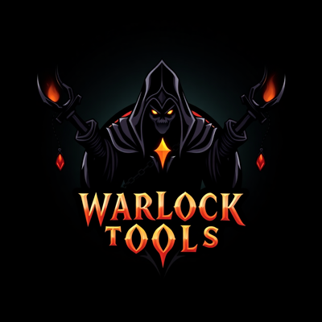

  

# WarlockTools

A warlock utility addon for WoW TBC Anniversary Classic.

## Features

- **HUD** — At-a-glance tracking of soul shards, healthstones, soulstones, spellstones, and firestones
- **Popup Spell Menu** — X-layout menu with buffs, stones, demons, and utility quadrants. Supports release-to-cast and keybind toggle
- **Healthstone Creation** — Shard economy panel showing how many healthstones you need vs what you have
- **Trade Helper** — Whisper queue with auto-reply and automatic healthstone placement in trade
- **Options Panel** — Tabbed settings for HUD, popup, trade, and appearance. Also available via Interface Options
- **Masque Support** — Optional button skinning via Masque

## Usage

| Command | Description |
|---------|-------------|
| `/wlt` | Show commands or changelog |
| `/wlt popup` | Toggle spell menu |
| `/wlt hud` | Toggle HUD |
| `/wlt summon` | Toggle healthstone creation panel |
| `/wlt queue` | Toggle trade queue |
| `/wlt options` | Open options panel |
| `/wlt tour` | Start onboarding tour |

## Installation

Copy the `WarlockTools` folder into your `Interface/AddOns` directory.

## Requirements

- WoW TBC Anniversary Classic (Interface 20505)
- Warlock class only — the addon will not load on other classes
- Optional: [Masque](https://www.curseforge.com/wow/addons/masque) for button skinning
